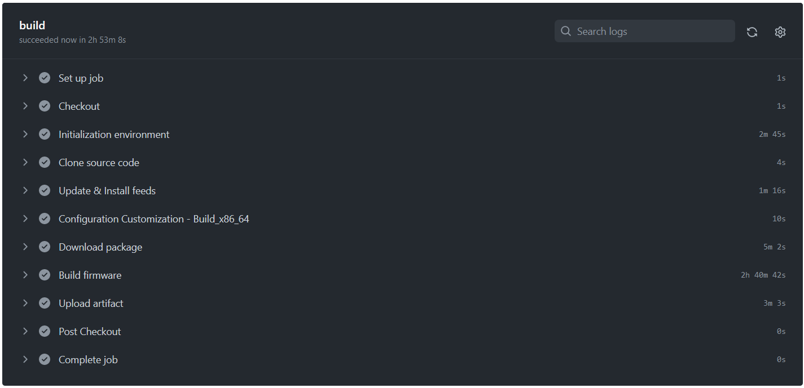
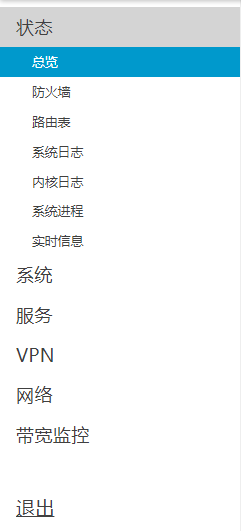
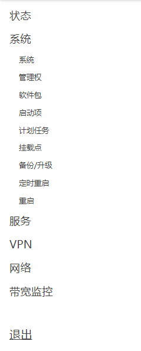
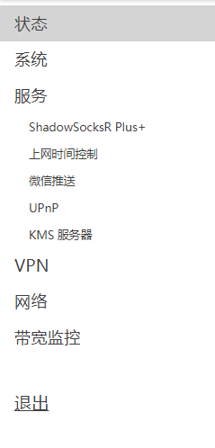
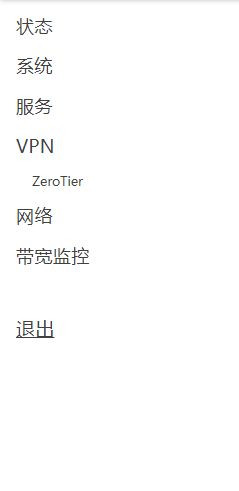
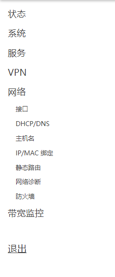

# 自动编译固件

自动编译lean的lede固件。
安装的是OpenClash。
教程链接：https://youtu.be/9YO7nxNry-4

## 说明

**1. 自动编译时间+插件**
每天下午

安装的插件

luci-app-accesscontrol

luci-app-arpbind

luci-app-autoreboot

luci-app-firewall

luci-app-nlbwmon

luci-app-serverchan

luci-app-openclash

luci-app-upnp

luci-app-vlmcsd

luci-app-zerotier

tailscale

管理ip

http://10.1.1.4

    
**2. 编译所需时间**

 

 

 

 

 

 

